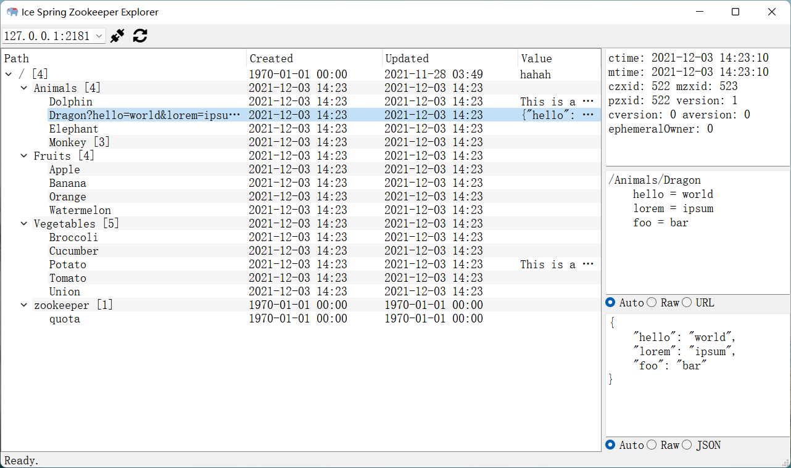

# Ice Spring Zookeeper Explorer

**Ice Spring Zookeeper Explorer** is a free utility to view `Zookeeper` data.

## Features

- `free` and `open-source`.
- `cross-platform`. `Windows`, `Linux` and `macOS`.
- `portable` No installation required.
- Support URL decode for Zookeeper path.
- Support JSON view for Zookeeper value.
- Support connection history

## Snapshots

## Download

Go to the release page to download.

There are only `Windows` release now. run `python make.py` to build for your OS.

## Run from source code

`pip install -r requirements.txt && python main.py`

## Build portable release

`pip install -r requirements.txt && python make.py`

## License

MIT
